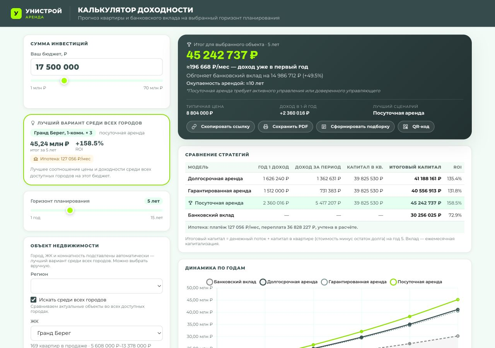
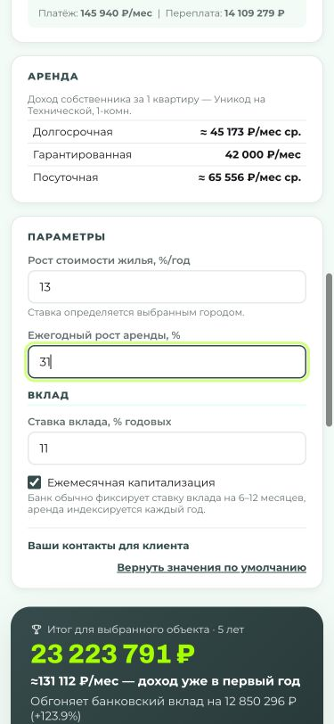
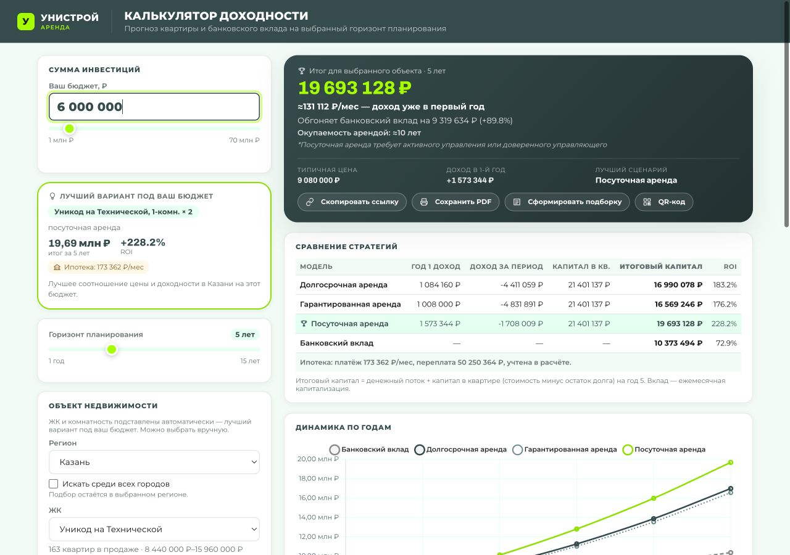
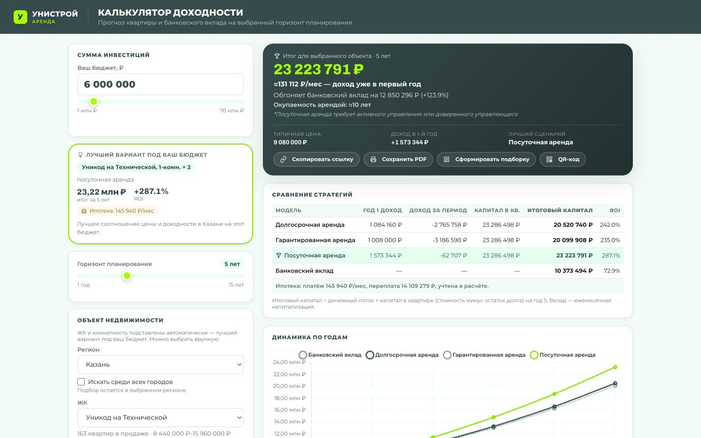

# Предрелизный QA-аудит инвестиционного калькулятора

**Дата:** 3 сентября 2026
**Объект:** `investment_calculator.html`
**Рабочая версия:** `b33f93f`, ветка `fix/qa-review-fixes`
**Продакшен:** `https://anton-shrmt.github.io/invest-calc/investment_calculator.html`, опубликованная версия `cefc81a`
**Дизайн-эталон:** родительский сайт и `../release_header`
**Итоговый вердикт:** **NO-GO**

> Ниже сохранён исходный аудит 3 сентября как историческое доказательство.
> Повторная приёмка релиза 4 сентября 2026 закрывает его вердикт: **GO после
> успешного GitHub Pages deployment и post-deploy smoke**. Идентификатором
> принятого релиза служит `releaseSha` публичного `release-manifest.json`; он
> также отображается в footer калькулятора.

## 0. Повторная приёмка после исправлений — 4 сентября 2026

| ID | Статус | Проверяемое исправление |
|---|---|---|
| REL-001 | CLOSED | HTML, данные, assets, vendor, release/test manifests собираются одним workflow; публичные SHA и SHA-256 проверяет post-deploy smoke |
| DATA-001 | CLOSED | `mhchkala`/`mahachkala` → `mhc`, `perm` → `per`; закрытый словарь и schema gate; неизвестный код/пустой результат останавливают обновление |
| FIN-001 | CLOSED | Разделены валовая выручка, выплата владельцу, ипотека, поток, доплаты, все вложения, equity и final capital; ROI считается на стартовый бюджет + доплаты |
| FIN-002 | MITIGATED | Неучтённые расходы перечислены рядом с результатом; неподтверждённые владелец/источник/дата/SLA ставок явно помечены. Их нельзя считать проверенными до продуктового подтверждения |
| PRIV-001 | CLOSED | QR строится локально; контакты не сериализуются и не уходят третьей стороне |
| UX-001 | CLOSED | Ошибки находятся рядом с полем, связаны `aria-describedby`, сохраняют значение и фокус |
| A11Y-001 | CLOSED | Контрастный `:focus-visible` добавлен всем контролам, включая range |
| COPY-001 | CLOSED | Удалены «доход уже в первый год» и «риск минимален»; продукт назван нейтрально «фиксированная арендная выплата» |
| DS-001 | CLOSED | TT Norms Pro/Expanded, logo/assets, tokens, радиусы и тени синхронизированы с `release_header` |
| DS-002 | CLOSED | Light/dark наследуются из сохранённого ключа сайта и системной темы; график обновляет контраст при переключении |
| UX-002 | CLOSED | На 375/768 px фиксированный summary показывает результат и даёт переход к полной карточке |
| A11Y-002 | CLOSED | `header/main/section/footer`, иерархия заголовков, состояния раскрытия, текст графика и зоны 44 px |
| PERF-001 | CLOSED | Chart.js, QR и шрифты локальные и defer; нет блокирующих CDN |
| SEO-001 | CLOSED | description, canonical, Open Graph, favicon и release meta добавлены |

Автоматические ворота: `node tests/run_all.mjs` — 4/4 suites; сборка —
`node scripts/build_release.mjs`; публичная проверка —
`node scripts/post_deploy_smoke.mjs <pages-url> <release-sha>`. Golden case
8 млн ₽ / 5 лет / ипотека 17% на 30 лет фиксирует: валовая аренда
3 180 000 ₽/год, выплата владельцу 1 573 344 ₽/год, ипотека 146 559 ₽/мес,
поток −185 369 ₽ за первый год, доплаты 316 172 ₽, все вложения 8 316 172 ₽,
итоговый капитал 23 702 705 ₽ и ROI 185,019%.

Визуально проверены 1440/768/375 px, обе темы, 200% reflow (эффективная ширина
188 px без горизонтального скролла), клавиатурный focus, ввод `9`, пауза,
`.5`, локальная ошибка на 375 px, локальный QR и переход к результату.
After-снимки: `qa_evidence/after-desktop-1440x900.png` и
`qa_evidence/after-tablet-768x1024.png`; точные viewport-метрики и production
smoke фиксируются в `qa_evidence/release-validation.md`.

Остаточные внешние зависимости решения: юридическое согласование формулировок
фиксированной выплаты и назначение владельца/источника/SLA финансовых
предпосылок. Калькулятор не скрывает их отсутствие и не изображает эти данные
как подтверждённые.

Продакшен нельзя считать готовым к публичному запуску. Найдены три независимых P0-блокера: на проде опубликован устаревший HTML без уже имеющихся локальных исправлений; новые данные содержат неизвестный код города и дают зависящий от стартового города финансовый результат; интерфейс обещает «доход уже в первый год» при отрицательном денежном потоке после ипотеки. До устранения этих проблем калькулятор способен показать клиенту неверный объект, неверную доходность и скрытую потребность в дополнительных деньгах.

## 1. Объём и методика

Проверено:

- соответствие расчётов формулам и граничным значениям;
- полный перебор доступных городов, ЖК, комнатностей, сроков и моделей аренды;
- автоподбор, ручной выбор, ипотека, вклад, URL, QR, PDF и localStorage;
- текущий публичный продакшен, а не только локальный файл;
- desktop 1440 px, tablet 768 px и mobile 375 px;
- клавиатурная навигация, фокус, семантика, подписи ошибок и базовый WCAG-проход;
- деградация при недоступности файла данных и Chart.js;
- XSS-поверхности пользовательских полей;
- визуальное соответствие `../release_header`: типографика, палитра, радиусы, логотип, темы, ритм и композиция;
- тексты, финансовые термины, дисклеймеры и потенциально рискованные обещания.

Автоматизированный полный перебор дал:

| Набор | Проекты | Комбинации ЖК × комнатность | Сценарии | Ошибки |
|---|---:|---:|---:|---:|
| Локальный снимок данных | 20 | 55 | 2 970 | 0 |
| Актуальные прод-данные | 19 | 53 | 2 862 | 1 структурная, с каскадными UI/расчётными последствиями |

Штатный регресс `node tests/calculator_regression.mjs` завершён: **OK**.

## 2. Критические блокеры

### REL-001 — P0 Critical — продакшен не соответствует проверяемой локальной версии

**Категория:** релизный процесс / регрессия.
**Доказательство:** локальный HTML и опубликованный HTML имеют разные Git-блобы; diff продакшена относительно локальной версии — 39 добавлений и 92 удаления. На проде отсутствуют уже внесённые локально исправления.

Подтверждённые регрессии на проде:

1. `PROJECTS` использует `window.CALCULATOR_PROJECTS || fallback`, поэтому валидный пустой массив не включает fallback и ломает расчёт. Локально добавлена проверка непустого массива (`investment_calculator.html:808`).
2. После ввода первой цифры ипотечной ставки ререндер уничтожает фокус. В живом тесте ввод `9`, пауза 500 мс, затем `.5` оставляет значение `9`, потому что вторая часть уходит уже не в поле. Локально это исправлено.
3. Ссылка из авто-режима на проде сериализует `proj`, `room`, `qty`; у получателя включается ручной режим и дальнейший автоподбор перестаёт работать. Локальная версия это исправляет (`investment_calculator.html:2194`).
4. PDF на проде может пометить несколько карточек как «Ваш выбор», так как сравнение не учитывает количество квартир. Локально исправлено.
5. На проде слабее проверка целочисленности количества квартир и нет нормализации российского телефона, введённого десятью цифрами.

**Ожидалось:** продакшен создан из того же коммита/артефакта, который прошёл регресс.
**Фактически:** CI обновил данные, но публичная страница содержит более старую логику.

**Риск:** результаты локального QA нельзя переносить на прод; исправленные дефекты снова доступны пользователям.

**Исправление:** публиковать HTML, данные и тестовый манифест как один атомарный артефакт; после deploy сверять commit SHA и хеши; добавить обязательный post-deploy smoke.

**Критерий приёмки:** HTML на проде совпадает с одобренным артефактом; пять сценариев выше проходят в публичном URL; в интерфейсе или техническом мета-файле виден release SHA.

### DATA-001 — P0 Critical — неизвестный `city_code` ломает глобальный автоподбор

**Категория:** данные / функциональность / финансовая корректность.
**Файлы:** `scripts/fetch_unistroy_prices.mjs:55-76`, актуальный `calculator_projects_data.js`.

Актуальный API вернул ЖК «Гранд Берег» с кодом `mhchkala`. Калькулятор знает Махачкалу как `mhc`, а генератор нормализует только `mahachkala → mhc` и `perm → per`. В итоге:

- в актуальных данных есть 197 квартир города `mhchkala`;
- Махачкалы нет в селекте продакшена;
- при бюджете 17 500 000 ₽ и поиске «по всем городам» выбирается «Гранд Берег, 1-комн. ×3»;
- селект города становится пустым;
- рост стоимости остаётся от предыдущего города, а не от Махачкалы;
- один и тот же URL даёт разные итоги в зависимости от города, сохранённого или открытого до расчёта.

Для 17,5 млн ₽ получены разные результаты:

| Стартовый город | Применённый рост | Итог |
|---|---:|---:|
| Казань / Екатеринбург | 13% | 45 242 737 ₽ |
| Санкт-Петербург / Пермь | другой городской коэффициент | вместо «Гранд Берега» выигрывает «Уникод», 45 238 161 ₽ |
| Тольятти | 14% | 47 434 389 ₽ |

Диапазоны бюджетов, где лучший кандидат имеет неизвестный город: 17,5–17,6; 26,2–26,4; 34,9–35,2; 61,0–61,6 млн ₽.

**Ожидалось:** любой объект данных имеет канонический город, существующий в UI, ставках роста и фильтрах.
**Фактически:** неизвестный код проходит в расчёт и наследует несвязанные настройки.

**Риск:** недетерминированный результат и неверная оценка будущей стоимости в клиентском финансовом инструменте.

**Исправление:** добавить `mhchkala → mhc`; валидировать данные по закрытому справочнику до публикации; падать в CI при неизвестном городе; не допускать кандидата в ранжирование, если для него нет валидных параметров.

**Критерий приёмки:** CI отклоняет любой неизвестный `city_code`; `mhchkala`, `mahachkala` и `mhc` дают один канонический код; результат глобального поиска не зависит от предыдущего города; селект всегда показывает выбранный город.

### FIN-001 — P0 Critical — «доход уже в первый год» при отрицательном денежном потоке

**Категория:** финансовая логика / UX-copy / mis-selling risk.
**Файлы:** `investment_calculator.html:730`, `investment_calculator.html:1520-1553`.

В базовом сценарии с бюджетом 8 млн ₽ интерфейс показывает примерно `131 112 ₽/мес — доход уже в первый год`, при этом платёж по ипотеке составляет примерно `146 559 ₽/мес`. Чистый поток до прочих затрат равен около **−15 447 ₽/мес** или **−185 364 ₽/год**. За пять лет таблица показывает кумулятивный денежный поток краткосрочной аренды **−99 847 ₽**, но стратегия всё равно названа лучшей, а ROI — `192,3%`.

Дополнительные взносы пользователя не показаны и не добавлены к знаменателю ROI. «Окупаемость арендой ≈10 лет» рассчитана по аренде до долга, налогов и дисконтирования, а не по свободному денежному потоку.

**Ожидалось:** «доход» означает ясно определённый показатель; отрицательный cash flow и необходимая доплата видны до CTA; ROI учитывает весь внесённый капитал.
**Фактически:** положительная валовая аренда визуально подменяет отрицательный чистый поток.

**Риск:** пользователь может принять инвестиционное решение, не увидев регулярную потребность в собственных средствах. Это одновременно продуктовый, репутационный и юридический риск.

**Исправление:** разделить «валовый арендный доход», «платёж по ипотеке», «операционные расходы», «налоги» и «чистый денежный поток»; показывать ежемесячную доплату; считать ROI на совокупный внесённый капитал; переименовать окупаемость или заменить её корректным показателем.

**Критерий приёмки:** при отрицательном потоке нет текста «доход уже в первый год»; видна сумма доплаты; таблица и карточка используют один термин; финансовая методика утверждена владельцем модели и проверена независимыми эталонными расчётами.

## 3. Major-находки

### FIN-002 — P1 Major — в модели и раскрытии условий отсутствуют существенные расходы

`CALCULATOR.md` заявляет честный учёт структуры налога и комиссии, но в расчёте налог равен нулю. Не учтены или явно не раскрыты: налог с аренды, налог при продаже, комиссия сделки, страхование и банковские расходы, отделка и мебель, ремонт и простой, коммунальные платежи, возможная индексация расходов, ликвидность и издержки выхода.

**Риск:** итоговая доходность системно завышена.
**Критерий приёмки:** методология перечисляет все включённые и исключённые статьи; обязательные статьи считаются либо пользователь явно подтверждает сценарий без них; юрист и финансовый владелец согласовали формулировки.

### DATA-002 — P1 Major — нет проверяемой родословной ставок аренды и роста цены

`RENT_RATES` и `APPRECIATION_BY_CITY` зашиты в HTML. Документация ссылается на `цены_для_калк.xlsx`, но такого файла в доступном проекте и родительском сайте нет. Для ставок нет даты среза, владельца, ссылки на источник, SLA обновления и автоматического контроля давности. UI показывает дату только для цен квартир.

**Риск:** расчёт выглядит актуальным, хотя ключевые входные параметры могут быть устаревшими или непроверяемыми.
**Критерий приёмки:** каждый набор ставок имеет источник, дату, владельца и допустимый возраст; интерфейс показывает дату всех финансово значимых данных; CI предупреждает или блокирует просрочку.

### PRIV-001 — P1 Major — QR передаёт сценарий и контакты внешнему сервису

`_updateQrImage()` (`investment_calculator.html:1773`) отправляет полный share URL в `api.qrserver.com`. URL может содержать бюджет, выбранный объект, финансовые предпосылки, имя и телефон менеджера (`mn`, `mp`). Запрос выполняется при открытии QR и автоматически при формировании PDF. Согласия и уведомления о передаче третьей стороне нет.

**Риск:** утечка контактных и коммерческих данных, несоответствие требованиям приватности.
**Критерий приёмки:** QR строится локально или через одобренный first-party сервис; контакты не сериализуются без необходимости; политика и согласие согласованы с ответственным за ПДн.

### UX-001 — P1 Major — ошибки ввода не привязаны к полям и уходят за экран

Все ошибки выводятся через общий `_setValidationMessage()` (`investment_calculator.html:2142`) в верхнюю подсказку блока. У полей с ошибкой нет `aria-describedby`. На mobile при вводе роста аренды `31` сообщение оказалось примерно на 1 482 px выше активного поля, вне viewport.

**Риск:** пользователь не понимает, почему расчёт не изменился; screen reader не связывает ошибку с вводом.
**Критерий приёмки:** сообщение находится рядом с полем, связано через `aria-describedby`, получает `role=status/alert` по необходимости, фокус не теряется, ошибка видна на 375 px.

### A11Y-001 — P1 Major — невидимый клавиатурный фокус у range-контролов

CSS отключает `outline` у слайдеров (`investment_calculator.html:162`) и не добавляет равноценный `:focus-visible`. Вычисленные стили: `outline-style: none`, `box-shadow: none`.

**Риск:** пользователь клавиатуры не видит активный контроль.
**Критерий приёмки:** все интерактивные элементы имеют контрастный `:focus-visible`; tab-порядок проверен с клавиатуры; визуальный фокус не перекрыт sticky-элементами.

### COPY-001 — P1 Major — неподтверждённое обещание «риск минимален»

Текст `*Гарантированный доход: риск минимален` (`investment_calculator.html:1520`) сочетает абсолютное обещание с расплывчатой оценкой риска. Это конфликтует со сценариями отрицательного потока, ипотекой, рыночной переоценкой и неполным учётом затрат.

**Риск:** mis-selling и претензии к рекламной/финансовой коммуникации.
**Критерий приёмки:** формулировку заменили на фактическое описание условий гарантии: кто гарантирует, срок, база расчёта, исключения, досрочное прекращение и ссылка на договор; текст согласован юристом.

### DS-001 — P2 Major — калькулятор не следует дизайн-системе лендинга

Подтверждённые расхождения с `../release_header`:

| Элемент | Калькулятор | Эталон |
|---|---|---|
| Основной шрифт | Montserrat | TT Norms Pro |
| Акцентный шрифт | Archivo | TT Norms Pro Expanded |
| Светлая мята | `#E5FFF1` | `#EDFFF5` |
| Вторичный фон | `#F2FBF6` | `#EBF1F1` |
| Основной тёмный | `#17161A` | `#263535` |
| Вторичный текст | `#262729` | `#637676` |
| Радиусы | 14/22 px | преимущественно 12/20 px |
| Логотип | текстовая имитация | фирменный asset |

Помимо токенов, калькулятор визуально плотнее лендинга: много подписей размером около 9,6–11,7 px, слабее вертикальный ритм, больше локальных декоративных решений. Это выглядит как отдельный микросайт, а не часть одного продукта.

**Критерий приёмки:** применены общие tokens/fonts/logo assets; компоненты сверены с эталоном на 1440/768/375 px; дизайнер подтвердил допустимые исключения.

### DS-002 — P2 Major — отсутствует поддержанная на лендинге тёмная тема

В `release_header` есть полноценное переключение light/dark; калькулятор существует только в светлой теме. Если калькулятор открывается как часть сайта, переход создаёт разрыв пользовательского опыта и может игнорировать сохранённый выбор темы.

**Критерий приёмки:** либо калькулятор наследует системную/сайтовую тему, либо продукт и дизайн явно утверждают light-only как исключение.

### UX-002 — P2 Major — основной результат слишком далеко от ввода на mobile

На ширине 375 px левая панель параметров занимает около 1 918 px высоты; победитель начинается примерно на Y=2 069. После изменения параметра пользователь не видит результата без длинной прокрутки. Связь «изменил → увидел эффект» теряется.

**Рекомендация:** компактный sticky-summary под ключевыми полями; progressive disclosure для расширенных настроек; быстрый переход «Показать результат»; сохранять позицию и не прыгать при ререндере.

### A11Y-002 — P2 Major — слабая семантика и малые цели касания

В документе нет семантических `main`, `header`, `footer`, `nav`; заголовки разделов реализованы `div`, поэтому структура почти не доступна вспомогательным технологиям. QR-toggle не сообщает `aria-expanded/aria-controls`; canvas не имеет доступного имени или текстовой альтернативы. Часть контролов ниже рекомендуемого удобного размера: input около 37,5–39,5 px, кнопки 43 px, checkbox 15 px, thumb слайдера 20 px.

**Критерий приёмки:** валидная иерархия landmarks/headings; корректные состояния раскрывающихся элементов; альтернативное текстовое представление графика; интерактивные зоны не менее 44×44 CSS px либо документированное исключение.

## 4. Minor-находки

### PERF-001 — P2 Minor — блокирующая внешняя загрузка Chart.js

Chart.js подключён синхронно в `<head>`. При медленном CDN он задерживает разбор документа; fallback помогает только после ошибки. Google Fonts — ещё одна внешняя зависимость и одновременно не соответствует фирменным локальным шрифтам.

**Рекомендация:** self-host approved bundle или отложенная загрузка; локальные TT Norms Pro; performance budget и тест slow/blocked third-party.

### SEO-001 — P3 Minor — минимальные метаданные

Есть title, viewport и favicon, но нет description, canonical и Open Graph. Для закрытого внутреннего инструмента это допустимо; для публичной страницы — недоработка.

## 5. Что подтверждено как работающее

- Локальная версия проходит штатный regression suite.
- 2 970 локальных сценариев не дали арифметических инвариантов, `NaN` или `Infinity`.
- При блокировке и внешнего файла данных, и Chart.js включается встроенный снимок, график скрывается, показывается понятный fallback-текст.
- Предупреждение об устаревших данных отображается.
- На 1440, 768 и 375 px нет глобального горизонтального скролла; детальная таблица на mobile ограничена собственным scroll-container.
- Авто-share URL в локальной версии не содержит `proj/room/qty`; ручной share их сохраняет.
- Локальное поле ипотечной ставки сохраняет фокус и корректно пересчитывает значение после завершения ввода.
- Пользовательские имя и телефон экранируются; тестовая строка `` не создала DOM-элемент и не выполнила код.
- Доступность краткосрочной аренды ограничивается предусмотренными комнатностями.
- Форматирование рублей, множественные квартиры и fallback цены/площади не создают арифметических сбоев.

## 6. Рекомендованный текст раскрытия условий

Текст ниже — продуктовая заготовка, не замена юридического согласования:

> Расчёт носит информационный характер и не является публичной офертой, индивидуальной инвестиционной рекомендацией или гарантией доходности. Результат основан на выбранных пользователем предположениях и данных, актуальных на указанные даты. Фактические цены, доступность объектов, ставки аренды, расходы, налоги, условия ипотеки, периоды простоя и стоимость объекта при продаже могут отличаться. Перед решением проверьте полный состав расходов и условия договоров.

Рядом с конкретной «гарантированной» программой дополнительно нужно раскрыть юридическое лицо-гаранта, срок, формулу выплаты, ограничения, исключения и ссылку на договор.

## 7. Вопросы, которые должны быть закрыты владельцами продукта

1. ROI считается на первоначальный бюджет или на весь капитал пользователя, включая последующие доплаты?
2. Что именно означает «доход»: валовая аренда, NOI или поток после ипотеки и налогов?
3. Какой договор и какое лицо обеспечивают «гарантированный доход»?
4. Почему налог равен нулю и для какой правовой/налоговой модели это допустимо?
5. Кто владелец `RENT_RATES` и `APPRECIATION_BY_CITY`, каков источник и SLA обновления?
6. Должен ли глобальный поиск включать Махачкалу, Нижний Новгород и любые новые города API автоматически?
7. Разрешена ли передача параметров расчёта и контактов внешнему QR-сервису?
8. Калькулятор обязан наследовать dark theme и токены публичного сайта или утверждён как отдельный light-only продукт?

## 8. План исправлений

### Must-fix до релиза

1. Исправить нормализацию `mhchkala`, добавить schema validation и заблокировать публикацию неизвестных городов.
2. Опубликовать локальные исправления единым проверенным артефактом и добавить post-deploy regression.
3. Пересобрать финансовую презентацию: net cash flow, доплаты, знаменатель ROI, корректная окупаемость.
4. Убрать или юридически обосновать «гарантированный доход / риск минимален».
5. Раскрыть/учесть налоги и расходы; согласовать методику с финансовым владельцем и юристом.
6. Убрать отправку сценария и контактов стороннему QR API либо оформить одобренную схему приватности.
7. Исправить локальные ошибки валидации и видимый keyboard focus.

### Ближайший бэклог

1. Перенести калькулятор на tokens, fonts и assets общей дизайн-системы.
2. Решить тему dark mode.
3. Упростить mobile flow и приблизить результат к изменяемым параметрам.
4. Добавить landmarks, heading hierarchy, состояния QR и альтернативу графику.
5. Self-host/отложенно загружать внешние зависимости.
6. Добавить description/canonical/OG, если страница индексируемая.

## 9. Обязательный smoke после исправлений

1. Открыть чистый прод URL без localStorage; зафиксировать release SHA и дату всех данных.
2. Проверить 8 млн ₽: вручную сверить аренду, ипотеку, чистый поток, требуемую доплату, итог и ROI.
3. Проверить глобальный поиск на 17,5; 26,3; 35,0; 61,3 млн ₽ из каждого стартового города.
4. Ввести ипотеку `9.5` с паузой после `9`; значение и фокус сохраняются.
5. Создать авто-share и manual-share; проверить round-trip режимов.
6. Сформировать PDF при одинаковом ЖК/комнатности и разном количестве; «Ваш выбор» ровно один.
7. Заблокировать data JS и Chart.js; калькулятор остаётся работоспособным без `NaN/Infinity`.
8. Проверить ошибки всех числовых полей на 375 px и через screen reader.
9. Пройти весь интерфейс Tab/Shift+Tab; фокус виден всегда.
10. Проверить QR/PDF без передачи данных неодобренной третьей стороне.
11. Сверить 1440/768/375 с утверждённым дизайн-макетом и обеими темами.

## 10. Недостающее автоматизированное покрытие

- контрактная схема для generated data и закрытый enum городов;
- тест неизвестного/нового `city_code` и алиасов;
- тест детерминированности глобального поиска независимо от localStorage и стартового города;
- эталонные финансовые golden cases, включая отрицательный cash flow и несколько ипотечных квартир;
- post-deploy тест соответствия SHA/хешей и критических сценариев;
- round-trip auto/manual share URL;
- QR privacy test: URL не покидает origin и не содержит лишних контактов;
- axe/WCAG smoke и keyboard-focus test;
- visual regression против общих дизайн-токенов на 1440/768/375;
- mobile тест видимости локальной ошибки рядом с полем;
- проверка свежести всех источников, не только цен квартир.

## 11. Release readiness

| Ворота | Статус | Условие перехода |
|---|---|---|
| Функциональность | **FAIL** | DATA-001 и регрессии REL-001 устранены на проде |
| Финансовая корректность | **FAIL** | FIN-001/FIN-002 утверждены и перепроверены |
| Данные | **FAIL** | schema/aliases/source dates/SLA введены |
| Приватность и тексты | **FAIL** | PRIV-001 и COPY-001 согласованы и исправлены |
| Доступность | **FAIL** | локальные ошибки и фокус исправлены; semantic smoke пройден |
| Визуальная консистентность | **FAIL** | дизайн-владелец принял tokens/fonts/theme/layout |
| Устойчивость | PASS с оговоркой | локальные fallback работают; нужен post-deploy контроль |
| Автотесты | PASS локально / **FAIL release gate** | тесты должны запускаться на публикуемом артефакте |

**Финальное решение: NO-GO.** Повторный release review допустим после закрытия всех P0 и P1, публикации единого артефакта и успешного smoke на публичном URL.

## 12. Артефакты

Скриншоты лежат в `qa_evidence/`:

- `production-global-search-mhchkala-17500000.png` — P0-баг неизвестного города;
- `production-desktop-current.png` — текущий публичный прод;
- `calculator-desktop-1440.png`, `calculator-desktop-viewport-1440x900.png`;
- `calculator-tablet-768x1024.png`;
- `calculator-mobile-375x812.png`, `calculator-mobile-375x812-full.png`;
- `mobile-invalid-rent-growth-message-offscreen.png`;
- `keyboard-focus-range-invisible.png`;
- `calculator-resilience-no-chart-no-data.png`;
- `reference-release-header-desktop-1280x720.png`, `reference-release-header-dark.png`.
